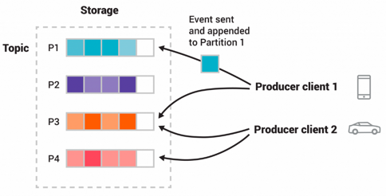

<h4 class="anchor-heading">
    <a class="anchor-link" id="intro_streaming" href="#intro_streaming"></a>
    <a href="#intro_streaming">What is event streaming?</a>
</h4>

# What is event streaming?

* Event streaming
  * == digital human body's central nervous system
  * uses
    * | 'always-active' world
      * businesses are
        * software-defined
        * automated,
      * user of software is software
  * goal
    * capture data | real-time -- from -- event sources
      * _Example:_ databases, sensors, mobile devices, cloud services, and software applications | form of streams of events
      * how does it work?
        * event streams are stored
      * uses of data
        * manipulate,
        * processing,
        * react to the event streams | real-time & retrospectively
        * routing the event streams -- to -- different destination technologies

<h4 class="anchor-heading">
          <a class="anchor-link" id="intro_usage" href="#intro_usage"></a>
          <a href="#intro_usage">What can I use event streaming for?</a>
</h4>

# What can I use event streaming for?

* [WIDE use cases](https://kafka.apache.org/powered-by) | DIFFERENT industries & organizations
  * process payments & financial transactions | real-time
    * _Example:_ stock exchanges, banks, and insurances 
  * track and monitor cars, trucks, fleets, and shipments | real-time
    * _Example:_ logistics & automotive industry 
  * continuously capture & analyze sensor data from IoT devices or other equipment
    * _Example:_ factories and wind parks
  * collect and immediately react to customer interactions and orders
    * _Example:_ retail, hotel and travel industry and mobile applications
  * monitor patients | hospital care and predict changes in condition
  * connect, store, and make available data / produced by different divisions of a company
  * foundation for 
    * data platforms,
    * event-driven architectures,
    * microservices

<h4 class="anchor-heading">
                            <a class="anchor-link" id="intro_platform" href="#intro_platform"></a>
                            <a href="#intro_platform">Apache Kafka&reg; == event streaming platform</a>
</h4>

# Apache Kafka == event streaming platform

* Kafka
  * 👀== 3 key capabilities, about event streaming, 👀
    * <strong>publish</strong> (to write) & <strong>subscribe</strong> (to read) -- streams of events /
      * include continuous import/export of your data -- from -- OTHER systems
    * <strong>store</strong> streams of events
      * durably
      * reliably
    * <strong>process</strong> streams of events |
      * as they occur or
      * retrospectively
  * allows
    * implementing your use cases -- for -- event streaming E2E / 👀1! battle-tested solution 👀
  * can be deployed | 
    * bare-metal hardware,
    * virtual machines,
    * containers,
    * on-premises
    * cloud
  * about managing
    * self-managing
    * fully managed services / -- offered by a -- variety of vendors
  * provides it's functionality in a manner 
    * distributed,
    * highly scalable,
    * elastic,
    * fault-tolerant,
    * secure

<h4 class="anchor-heading">
                            <a class="anchor-link" id="intro_nutshell" href="#intro_nutshell"></a>
                            <a href="#intro_nutshell">How does Kafka work | nutshell?</a>
</h4>

# How does Kafka work | nutshell?

* Kafka
  * 👀 servers + clients 👀
    * == distributed system
    * / communicate -- via a -- high-performance [TCP network protocol](protocol.md)
    * Servers
      * 👀== cluster of >=1 servers 👀/ 
        * can span multiple datacenters OR cloud regions
        * uses of these servers
          * 👀brokers == storage layer / made up of SOME of these previous servers 👀
          * run [Kafka Connect](connect.md) 
      * highly scalable & fault-tolerant
        * == if ANY of its servers fails -> other servers -- will take over -- their work
          * Reason: 🧠ensure continuous operations / NO data loss 🧠
    * Clients
      * allow you
        * write distributed applications & microservices / about streams of events
          * actions
            * read,
            * write,
            * process
          * via
            * in parallel,
            * at scale,
            * fault-tolerant
      * available | MANY programming languages 
      * types
        * built-in
          * java-based
        * [community](https://cwiki.apache.org/confluence/display/KAFKA/Clients)

<h4 class="anchor-heading">
                            <a class="anchor-link" id="intro_concepts_and_terms" href="#intro_concepts_and_terms"></a>
                            <a href="#intro_concepts_and_terms">Main Concepts and Terminology</a>
</h4>

# Main Concepts and Terminology

* event or record or message
  * goal
    * 👀records the fact that "something happened"👀
  * uses
    * ANY read or write data to Kafka -- is done via -- events
  * == key + value + timestamp + optional metadata headers
    * _Example:_
        ```
        Event key: "Alice"
        Event value: "Made a payment of $200 to Bob"
        Event timestamp: "Jun. 25, 2020 at 2:06 p.m."
        ```
  * 💡organized and durably stored | topics💡
    * store data | long time is PERFECTLY fine
      * Reason: 🧠Kafka's performance is effectively constant -- respect to -- data size 🧠 
  * 💡can be read as often as needed💡
    * != traditional messaging systems
      * Reason: 🧠 ONCE events are consumed -> NOT deleted 🧠
    * 👀UNTIL event's time life👀
      * ⚠️configuration setting / topic ⚠️ 

* topics
  * 💡== filesystem's folder 💡 
    * -> events == files | that folder
  * are ALWAYS multi-producer & multi-subscriber
    * == topic can have
      * \>=0 producers / write events | it
      * \>=0 consumers / subscribe | these events 
  * 👀are partitioned 👀
    * == topic -- is spread over a -- # of "buckets" / located | DIFFERENT Kafka brokers 
    * -> scalability
      * Reason: 🧠client applications can read and write data -- from/to -- MANY brokers | SAME time 🧠
    * 👀if a NEW event is published | a topic -> appended | one of the topic's partitions 👀
    * events / SAME event's key -> written | SAME partition
    * _Example:_
      * 2 DIFFERENT producer clients are publishing independently
      * BOTH producers can write | SAME partition
      
        
  * 👀can be replicated 👀
    * -> your data fault-tolerant and highly-available
    * EVEN ACROSS geo-regions or datacenters
      * that's why there are ALWAYS MULTIPLE brokers
    * _Example:_ (MOST common production setting) replication factor of 3
      * == ALWAYS be 3 copies of your data

* Producers
  * client applications / publish (write) events to Kafka
* Consumers
  * client applications / subscribe to (read and process) these events

* In Kafka,
  * 👀producers <- fully decoupled & agnostic of -> consumers 👀
    * Reason: 🧠enable high scalability of Kafka 🧠
    * _Example:_ producers NEVER need to wait for consumers
  * 👀consumers 
    * process events [exactly-1!](design.md#46-message-delivery-semantics) 👀
    * of a GIVEN topic-partition -- will always read -- that partition's events | SAME order / they were written 👀

<h4 class="anchor-heading">
                            <a class="anchor-link" id="intro_apis" href="#intro_apis"></a>
                            <a href="#intro_apis">Kafka APIs</a>
</h4>

# Kafka APIs

* Kafka CLI
  * uses
    * tasks of
      * management
      * administration

* [Kafka core APIs](api.md)
